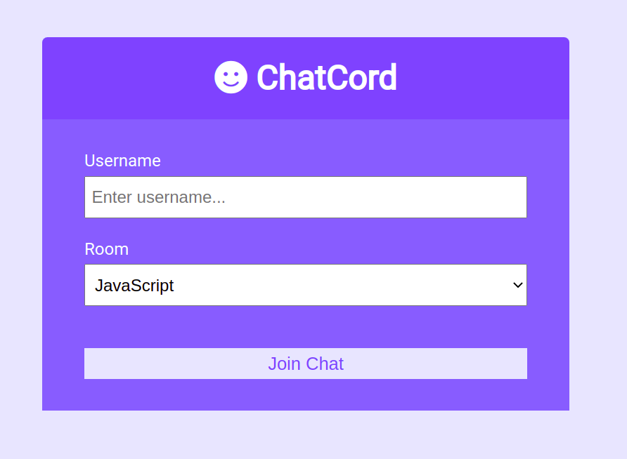

<h1 align="center">
    
</h1>

---

# 📝 About

Created a real chat with Nodejs, Express and Socket.io.

---

## 🚀 Tecnologias utilizadas

- [Nodejs](https://nodejs.org/)
- [Express](https://www.npmjs.com/package/express)
- [Socket.io](https://www.npmjs.com/package/socket.io)

---

## 📁 Como baixar o projeto

```bash

    # Clonar o repositório
    $ git clone https://github.com/lrdplopes/realchat_nodejs

    #Acessar o repositório
    $ cd realchat_nodejs

    #Instalar suas dependências
    $yarn install

    #Iniciar o projeto
    $yarn start

```

---

Será um prazer conectar contigo através das minhas redes sociais:

✔ [Linkedin](https://www.linkedin.com/in/lucasrd-pereira/) <br>
✔ [GitHub](https://github.com/lrdplopes) <br>
✔ [Twitter](https://twitter.com/lrdp_lopes) <br>

---

⚛️ Kind regards,
Lucas Pereira. <br>
